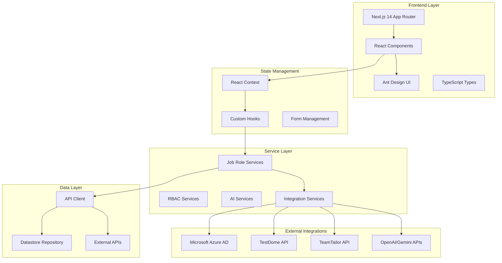
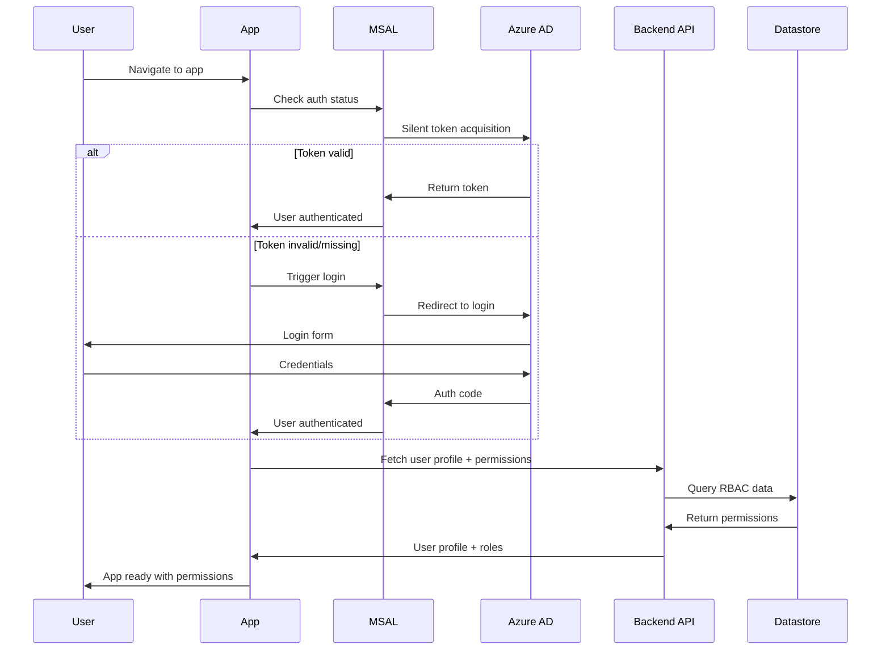
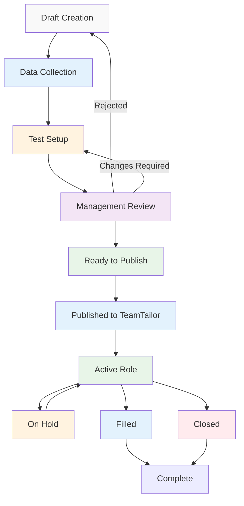
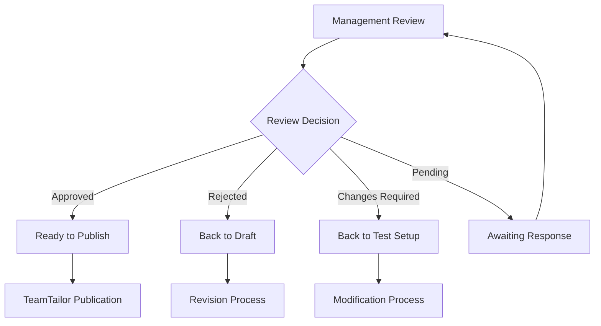
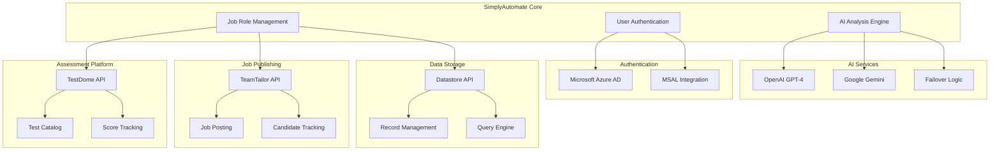
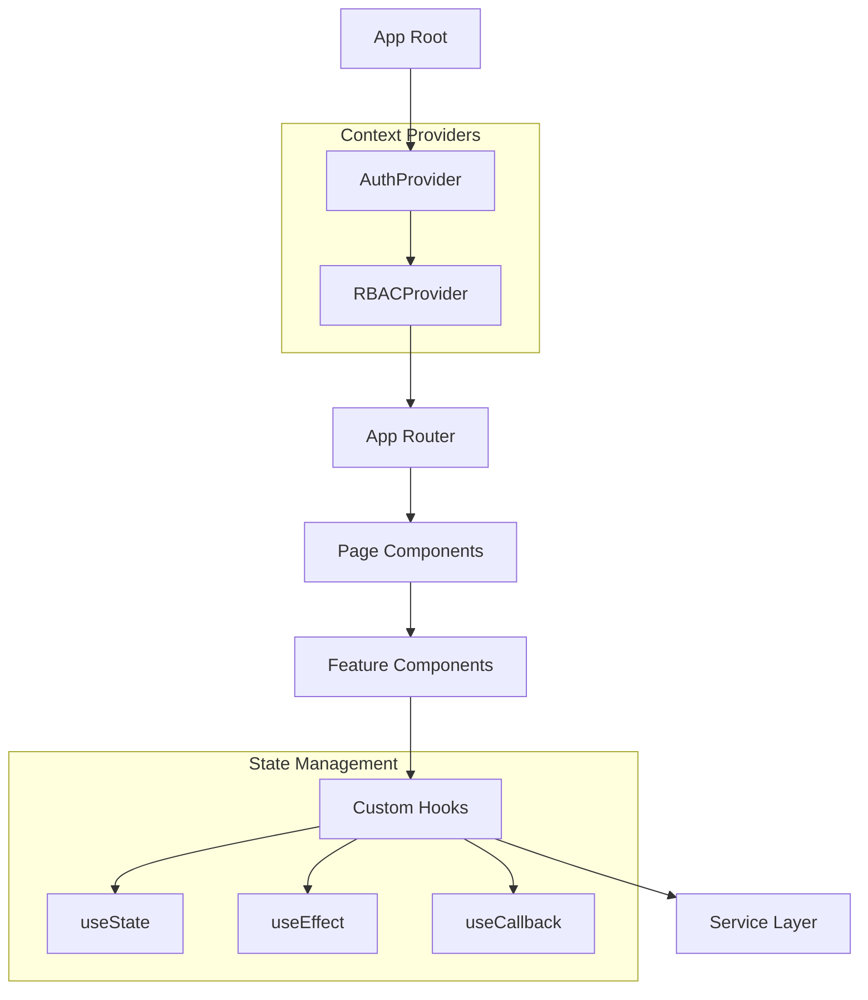
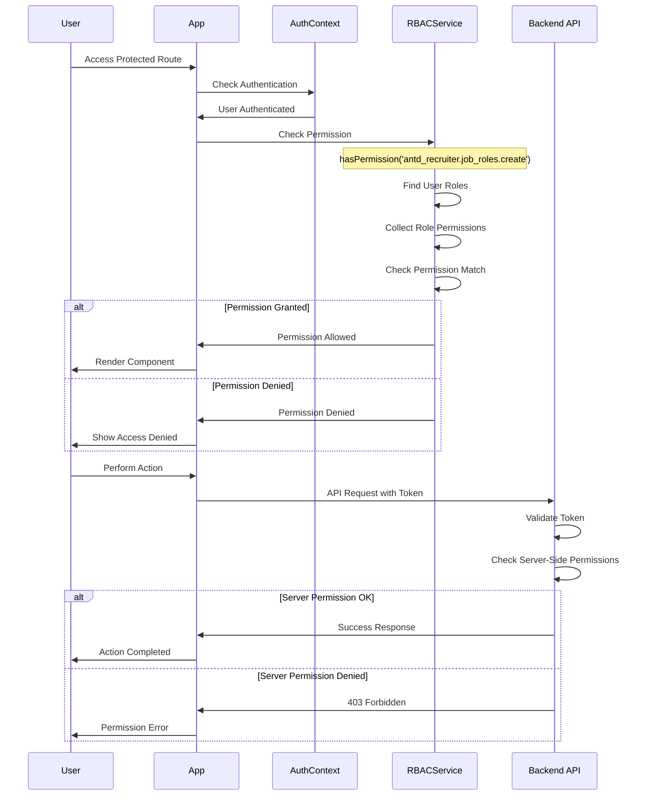
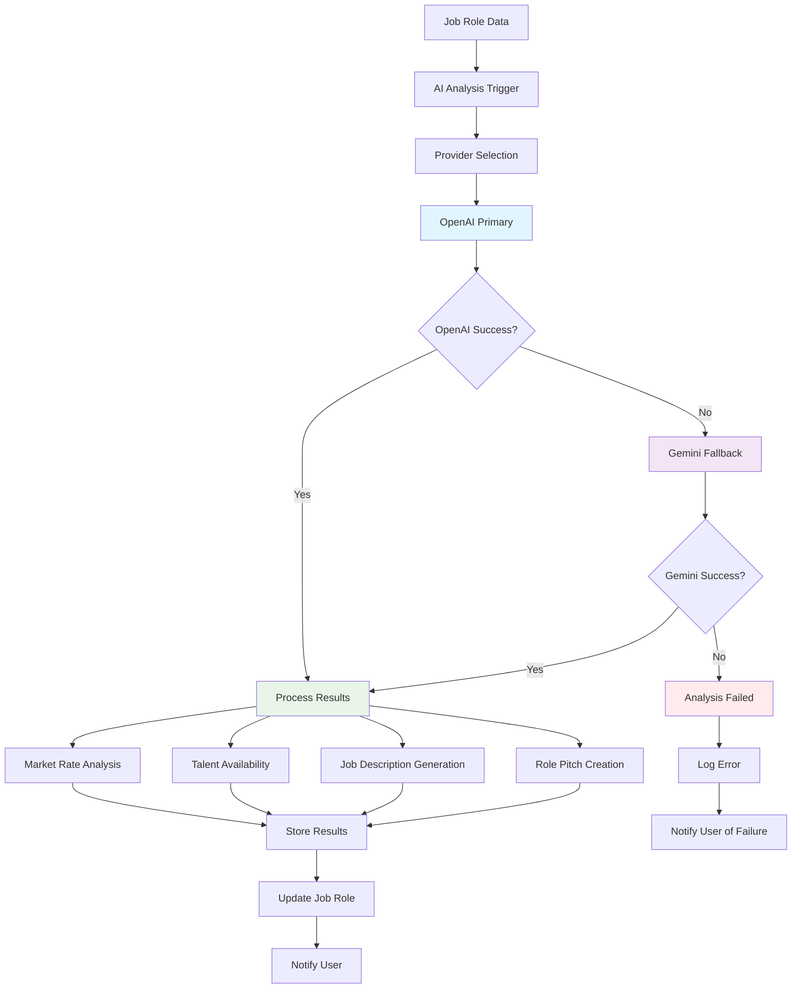
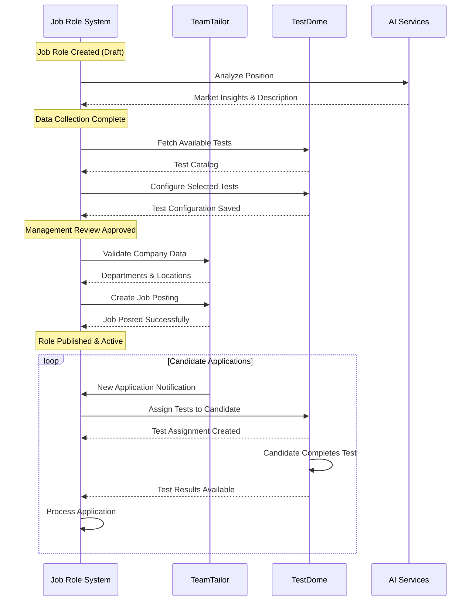

# Complete Application Documentation
## SimplyAutomate Recruitment Management Platform

---

## Table of Contents
1. [Executive Summary](#executive-summary)
2. [Application Architecture](#application-architecture)
3. [Authentication & RBAC System](#authentication--rbac-system)
4. [Job Role Lifecycle Management](#job-role-lifecycle-management)
5. [Data Models & Types](#data-models--types)
6. [Integration Architecture](#integration-architecture)
7. [Technical Implementation](#technical-implementation)
8. [Workflow Diagrams](#workflow-diagrams)
9. [Security & Performance](#security--performance)
10. [Deployment & Operations](#deployment--operations)

---

## Executive Summary

### What is SimplyAutomate?
SimplyAutomate is a **next-generation recruitment management platform** built on React/Next.js 14 with TypeScript. It provides a comprehensive solution for managing the entire job role lifecycle from creation to publication, with integrated AI-powered insights, external platform integrations, and enterprise-grade role-based access control.

### Key Business Value
- **Streamlined Workflow**: Multi-stage approval process with automated status progression
- **AI-Powered Insights**: Market rate analysis and talent availability using OpenAI & Gemini
- **External Integrations**: Seamless connection with TestDome for assessments and TeamTailor for job publishing
- **Enterprise Security**: Microsoft Azure AD authentication with granular RBAC permissions
- **Data-Driven Decisions**: Comprehensive analytics and reporting capabilities

### Target Users
- **Recruiters**: Job role creation and candidate management
- **HR Managers**: Workflow oversight and compliance management
- **Recruitment Leads**: Team coordination and process optimization  
- **Directors**: Strategic oversight and final approvals
- **System Admins**: RBAC management and system configuration

---

## Application Architecture

### High-Level System Architecture



### Folder Structure & Organization

```
src/
├── 📁 app/                          # Next.js 14 App Router
│   ├── 📁 admin/                    # RBAC Administration
│   │   ├── users/                   # User management
│   │   ├── roles/                   # Role management
│   │   └── permissions/             # Permission management
│   ├── 📁 roles/                    # Job Roles Management (Core Feature)
│   │   ├── components/              # Role-specific components
│   │   ├── hooks/                   # Role operation hooks
│   │   ├── utils/                   # Status utilities
│   │   └── page.tsx                 # Main roles page
│   ├── 📁 dashboard/                # Analytics & Overview
│   ├── 📁 api/                      # API Routes & Webhooks
│   └── layout.tsx                   # Root layout with auth
├── 📁 components/                   # Reusable UI Components
│   ├── job-roles/                   # Job role modals & forms
│   ├── auth/                        # Authentication components
│   ├── guards/                      # Permission guards
│   └── navigation/                  # App navigation
├── 📁 services/                     # Business Logic Layer
│   ├── rbac/                        # Role-based access control
│   ├── ai/                          # AI service integrations
│   ├── jobRoles/                    # Job role operations
│   ├── testing/                     # TestDome integration
│   └── api.ts                       # Base API client
├── 📁 hooks/                        # Custom React Hooks
├── 📁 types/                        # TypeScript Definitions
├── 📁 contexts/                     # React Contexts
├── 📁 lib/                          # External Libraries
│   └── integrations/                # TeamTailor, TestDome clients
└── 📁 config/                       # Configuration files
```

### Core Design Principles

1. **SOLID Principles**
   - Single Responsibility: Each component has one purpose
   - Open/Closed: Extensible through composition
   - Liskov Substitution: Interface-driven design
   - Interface Segregation: Focused interfaces
   - Dependency Inversion: Abstractions over concretions

2. **Clean Architecture**
   - UI Layer: React components and state management
   - Business Logic: Service layer with validation
   - Data Layer: Repository pattern with API abstraction

3. **Domain-Driven Design**
   - Job Role aggregate as core entity
   - Status-driven workflow management
   - Event-driven state transitions

---

## Authentication & RBAC System

### Authentication Flow



### RBAC System Architecture

#### Role Hierarchy
```
┌─────────────────────────────────────────────────────────────┐
│                        RBAC HIERARCHY                       │
├─────────────────────────────────────────────────────────────┤
│  System Admin                                              │
│    └── Full system access, user management                 │
│                                                            │
│  Director                                                  │
│    ├── Final job role approvals                           │
│    ├── Budget authorization                               │
│    └── Strategic oversight                                │
│         │                                                 │
│         └── Recruitment Lead                              │
│             ├── Team management                           │
│             ├── Process oversight                         │
│             └── Management review approvals               │
│                  │                                        │
│                  └── HR Manager                           │
│                      ├── Test setup approvals            │
│                      ├── Compliance verification          │
│                      └── Interview coordination           │
│                           │                              │
│                           └── Recruiter                  │
│                               ├── Job role creation      │
│                               ├── Data collection        │
│                               └── Candidate management    │
└─────────────────────────────────────────────────────────────┘
```

#### Permission Structure
```
Permission Format: {scope}.{resource}.{action}

Scope Types:
├── system.*                    # Global system permissions
└── antd_recruiter.*           # Application-specific permissions

Resource Categories:
├── users                      # User management
├── roles                      # Role management  
├── permissions               # Permission management
├── job_roles                 # Job role operations
├── data_collection          # Data collection workflow
├── test_setup              # Test configuration
├── management_review       # Management approval
└── analytics              # Reporting & analytics

Action Types:
├── create                 # Create new resources
├── read                  # View resources
├── update               # Modify resources
├── delete              # Remove resources
├── approve            # Approval actions
├── publish           # Publishing actions
└── manage           # Administrative actions
```

#### Example Permissions
```yaml
# Recruiter Permissions
antd_recruiter.job_roles.create
antd_recruiter.job_roles.read
antd_recruiter.job_roles.update
antd_recruiter.data_collection.create
antd_recruiter.data_collection.update

# HR Manager Permissions (inherits Recruiter + additional)
antd_recruiter.test_setup.approve
antd_recruiter.job_roles.approve_data_collection
antd_recruiter.analytics.read

# Recruitment Lead Permissions (inherits HR Manager + additional)
antd_recruiter.management_review.approve
antd_recruiter.job_roles.approve_test_setup
antd_recruiter.analytics.manage

# Director Permissions (inherits all + additional)
antd_recruiter.job_roles.approve_final
antd_recruiter.job_roles.publish
system.users.manage
system.roles.manage
```

### Implementation Details

#### AuthContext Integration
```typescript
interface AuthContextType {
  // Authentication
  user: User | null;
  isAuthenticated: boolean;
  login: () => void;
  logout: () => void;
  
  // RBAC Integration
  userRoles: Role[];
  permissions: string[];
  hasPermission: (permission: string) => boolean;
  hasAnyPermission: (permissions: string[]) => boolean;
  hasRole: (roleName: string) => boolean;
  
  // Loading States
  loading: boolean;
  rbacLoading: boolean;
}
```

#### Permission Guards
```typescript
// Component-level protection
<PermissionGuard requiredPermission="antd_recruiter.job_roles.create">
  <CreateJobRoleButton />
</PermissionGuard>

// Route-level protection
<RequirePermissions permissions={["antd_recruiter.job_roles.read"]}>
  <JobRolesPage />
</RequirePermissions>

// Hook-based checking
const { hasPermission } = useAuth();
const canApprove = hasPermission("antd_recruiter.management_review.approve");
```

---

## Job Role Lifecycle Management

### Complete Workflow Overview



### Stage-by-Stage Breakdown

#### 1. Draft Creation (Multi-Stage Wizard)

**Purpose**: Create comprehensive job role specification
**Owner**: Recruiter
**Required Permissions**: `antd_recruiter.job_roles.create`

**Wizard Stages:**
```
Stage 1: Company Selection
├── Choose from integrated companies
├── Company-specific settings loading
└── Department/client pre-population

Stage 2: Basic Information
├── Job title and department
├── Employment type and level
├── Location and timezone
├── Budget and compensation
├── Resource requirements
└── Start date planning

Stage 3: Skills & Qualifications
├── Required skills (must-have)
├── Preferred qualifications (nice-to-have)
├── Key responsibilities
└── Experience requirements

Stage 4: AI Position Analysis
├── Market rate analysis (PH vs USA)
├── Talent availability assessment
├── AI-generated job descriptions
├── Professional role pitch
└── Competitive intelligence

Stage 5: Review & Draft Save
├── Complete data validation
├── Summary presentation
├── Priority level setting
└── Draft creation
```

**AI Analysis Components:**
```typescript
interface PositionAnalysisResults {
  marketRates: {
    philippines: { min: number; max: number; confidence: string };
    usa: { min: number; max: number; confidence: string };
  };
  talentAvailability: {
    score: number; // 1-100
    status: 'abundant' | 'moderate' | 'limited' | 'scarce';
    timeline: string;
    insights: string[];
  };
  jobDescription: {
    content: string;
    wordCount: number;
    readingTime: number;
  };
  rolePitch: {
    content: string;
    keyPoints: string[];
  };
}
```

#### 2. Data Collection Phase

**Purpose**: Gather detailed hiring process requirements
**Owner**: Recruiter/HR Manager  
**Required Permissions**: `antd_recruiter.data_collection.create`

**Collection Areas:**
```
Interview Setup
├── Skills Interview Configuration
│   ├── Interviewer assignments
│   ├── Interview kit selection
│   ├── Scheduling preferences
│   └── Joint vs separate interviews
└── Final Interview Setup
    ├── Client interview requirements
    ├── Client interviewer details
    └── Availability coordination

Systems Access Requirements  
├── Device provision needs
├── Microsoft 365 requirements
├── Specific app access (Teams, SharePoint, etc.)
├── Additional tools and software
└── Security clearance levels

Application Questions
├── US shift experience requirements
├── Custom screening questions
├── Deal-breaker assessments
└── Regulatory compliance questions

Sifting Criteria
├── Must-have skills validation
├── Nice-to-have skills scoring
├── Red flags and disqualifiers
├── Sifting process ownership
└── Evaluation rubrics
```

#### 3. Test Setup Phase

**Purpose**: Configure candidate assessment strategy
**Owner**: HR Manager
**Required Permissions**: `antd_recruiter.test_setup.approve`

**TestDome Integration Features:**
```
Test Configuration
├── Available Tests Library
│   ├── Programming tests (by language)
│   ├── Knowledge assessments
│   ├── Multiple choice evaluations
│   └── Open-ended challenges
├── Test Selection Criteria
│   ├── Skills-based filtering
│   ├── Difficulty level matching
│   ├── Duration considerations
│   └── Pass/fail thresholds
└── Assessment Rules
    ├── Mandatory vs optional tests
    ├── All-must-pass vs any-can-pass
    ├── Auto-rejection on failure
    └── Manual review options

Candidate Instructions
├── Test preparation guidelines
├── Technical requirements
├── Deadline communications
└── Support contact information
```

**Test Configuration Interface:**
```typescript
interface TestSetupData {
  tests_required: boolean;
  selected_tests: TestConfiguration[];
  test_instructions: string;
  test_deadline_days: number;
  send_test_immediately: boolean;
  require_all_tests: boolean;
  auto_screen_failures: boolean;
  test_coordinator: string;
  custom_test_requirements: string;
}

interface TestConfiguration {
  test_id: string;
  test_name: string;
  duration_minutes: number;
  passing_score: number;
  skills_assessed: string[];
  difficulty_level: 'beginner' | 'intermediate' | 'advanced' | 'expert';
  is_mandatory: boolean;
  test_order: number;
}
```

#### 4. Management Review Phase

**Purpose**: Executive approval and compliance validation
**Owner**: Recruitment Lead/Director
**Required Permissions**: `antd_recruiter.management_review.approve`

**Review Components:**
```
Review & Decision
├── Approval Status (Pending/Approved/Rejected/Changes Required)
├── Priority Level Assignment (Urgent/High/Normal/Low)
├── Review Notes and Feedback
├── Change Requests (if applicable)
├── Timeline Estimation
└── Reviewer Information

Budget Approval
├── Target Budget Validation
├── Maximum Budget Authorization
├── Final Approved Amount
├── Budget Approval Notes
└── Financial Compliance Check

Hiring Manager Approval
├── Hiring Manager Sign-off
├── Approval Documentation
├── Conditional Approvals
└── Stakeholder Buy-in

Compliance Checklist
├── Finance Team Budget Approval ✓
├── HR Headcount Approval ✓
├── Department Head Authorization ✓
├── Legal Review (if required) ✓
├── Diversity & Inclusion Requirements ✓
└── Regulatory Compliance ✓
```

**Decision Flow:**


#### 5. Publication & Activation

**Purpose**: External job posting and candidate attraction
**Owner**: Director/System
**Required Permissions**: `antd_recruiter.job_roles.publish`

**TeamTailor Integration:**
```
Pre-Publication Setup
├── Field Mapping Validation
├── Required Information Check
├── Compliance Verification
└── Stakeholder Notification

Publication Process
├── TeamTailor Job Creation
├── Custom Fields Population
├── Department/Location Assignment
├── Publication Date Setting
└── Visibility Configuration

Post-Publication Tracking
├── Application Tracking
├── Performance Metrics
├── Candidate Pipeline
└── Status Synchronization
```

---

## Data Models & Types

### Core Job Role Entity

```typescript
interface JobRole {
  // Identity & Metadata
  role_id: string;                    // UUID primary key
  app_id: string;                     // Application identifier
  record_id: string;                  // Datastore record ID
  
  // Company Information
  company_id: string;                 // Selected company ID
  company_name: string;               // Company name for display
  
  // Basic Role Information
  title: string;                      // Job title
  department: string;                 // Department from TeamTailor
  client?: string;                    // Client from TeamTailor
  account_exec?: string;              // Account Executive
  level: JobLevel;                    // Seniority level
  employment_type: EmploymentType;    // Employment classification
  location: string;                   // Job location or "Remote"
  location_type: 'remote' | 'hybrid' | 'on-site';
  
  // Budget & Compensation
  target_budget_usd?: number;         // Target budget in USD
  maximum_budget_usd?: number;        // Maximum budget in USD
  currency: string;                   // Currency code
  budget_notes?: string;              // Budget-related notes
  
  // Role Requirements
  number_of_resources: number;        // Number of positions
  desired_minimum_years_experience: number;
  requirements: string[];             // Required skills
  preferred_qualifications: string[]; // Preferred skills
  responsibilities: string[];         // Key responsibilities
  description: string;                // Detailed description
  
  // Workflow Stages Data
  data_collection?: DataCollectionData;
  test_setup?: TestSetupData;
  management_review?: ManagementReviewData;
  position_analysis?: PositionAnalysisResults;
  
  // Status & Lifecycle
  status: JobRoleStatus;              // Current workflow status
  is_priority: boolean;               // Priority flag
  openings_count: number;             // Positions to fill
  filled_count: number;               // Positions filled
  
  // External Integrations
  teamtailor_job_id?: string;         // TeamTailor job ID
  published_to_teamtailor: boolean;   // Publication status
  
  // Audit Trail
  created_at: string;                 // Creation timestamp
  updated_at: string;                 // Last update timestamp
  created_by: string;                 // Creator ID
  updated_by: string;                 // Last modifier ID
}
```

### Status Enumeration & Progression

```typescript
type JobRoleStatus = 
  'draft' |                    // Initial creation
  'data_collection' |          // Gathering hiring requirements
  'test_setup' |              // Configuring assessments
  'management_review' |        // Approval process
  'ready_to_publish' |         // Ready for external posting
  'published_to_teamtailor' |  // Posted externally
  'active' |                   // Live and accepting applications
  'on-hold' |                  // Temporarily paused
  'filled' |                   // All positions filled
  'closed';                    // Permanently closed

// Status progression mapping
const STATUS_PROGRESSION: Record<JobRoleStatus, JobRoleStatus> = {
  'draft': 'data_collection',
  'data_collection': 'test_setup',
  'test_setup': 'management_review',
  'management_review': 'ready_to_publish',
  'ready_to_publish': 'published_to_teamtailor',
  'published_to_teamtailor': 'active',
  'active': 'active',          // Terminal state
  'on-hold': 'on-hold',        // Can return to active
  'filled': 'filled',          // Terminal state
  'closed': 'closed'           // Terminal state
};
```

### Workflow Stage Data Structures

#### Data Collection Model
```typescript
interface DataCollectionData {
  interview_setup: {
    skills_interview: {
      interviewers: InterviewerInfo[];
      interview_kit_name?: string;
      max_interviews_per_day?: number;
      joint_or_separate: 'joint' | 'separate' | 'flexible';
      timezone_preference?: string;
      notes?: string;
    };
    final_interview: {
      client_interview_required: 'yes' | 'no' | 'tbc';
      client_interviewers: InterviewerInfo[];
      availability?: string;
      notes?: string;
    };
  };
  
  systems_access: {
    device_provided: 'yes' | 'no';
    microsoft_365_required: 'yes' | 'no';
    microsoft_apps_required: string[];
    sharepoint_access_requirements?: string;
    additional_tools_software?: string[];
  };
  
  application_questions: {
    us_shift_experience: 'required' | 'preferred' | 'not_required';
    custom_questions: string[];
  };
  
  sifting_criteria: {
    must_have_skills: string[];
    nice_to_have_skills: string[];
    disqualifiers_red_flags: string[];
    sifting_owner?: string;
    notes?: string;
  };
  
  completion_metadata?: {
    completed_at?: string;
    completed_by?: string;
    completion_notes?: string;
  };
}
```

#### Test Setup Model
```typescript
interface TestSetupData {
  tests_required: boolean;
  selected_tests: TestConfiguration[];
  test_instructions?: string;
  test_deadline_days?: number;
  send_test_immediately?: boolean;
  require_all_tests?: boolean;
  auto_screen_failures?: boolean;
  test_coordinator?: string;
  custom_test_requirements?: string;
  completion_metadata?: {
    configured_at?: string;
    configured_by?: string;
    configuration_notes?: string;
  };
}

interface TestConfiguration {
  test_id: string;
  test_name: string;
  test_url?: string;
  duration_minutes?: number;
  passing_score?: number;
  description?: string;
  skills_assessed: string[];
  difficulty_level?: 'beginner' | 'intermediate' | 'advanced' | 'expert';
  is_mandatory: boolean;
  test_order?: number;
  programming_languages?: string[];
  test_type: 'programming' | 'knowledge' | 'multiple-choice' | 'open-ended';
}
```

#### Management Review Model
```typescript
interface ManagementReviewData {
  review_status: 'pending' | 'approved' | 'rejected' | 'requires_changes';
  reviewer_name?: string;
  reviewer_email?: string;
  review_notes?: string;
  requested_changes?: string[];
  priority_level?: 'urgent' | 'high' | 'normal' | 'low';
  estimated_approval_timeline?: string;
  
  approved_budget?: {
    target_budget_approved: boolean;
    maximum_budget_approved: boolean;
    approved_budget_amount?: number;
    budget_approval_notes?: string;
  };
  
  hiring_manager_approval?: {
    approved: boolean;
    hiring_manager_name?: string;
    approval_date?: string;
    approval_notes?: string;
  };
  
  compliance_checklist?: {
    budget_approved: boolean;
    headcount_approved: boolean;
    department_approval: boolean;
    legal_review_needed: boolean;
    diversity_requirements_met: boolean;
  };
  
  completion_metadata?: {
    reviewed_at?: string;
    reviewed_by?: string;
    review_duration_hours?: number;
    escalation_required?: boolean;
  };
}
```

---

## Integration Architecture

### External Service Integrations Overview



### Microsoft Azure AD Integration

**Implementation**: Microsoft Authentication Library (MSAL)
**Features**: Single Sign-On, Profile Management, Token Management

```typescript
// MSAL Configuration
const msalConfig = {
  auth: {
    clientId: process.env.NEXT_PUBLIC_AZURE_CLIENT_ID,
    authority: `https://login.microsoftonline.com/${tenantId}`,
    redirectUri: process.env.NEXT_PUBLIC_REDIRECT_URI,
  },
  cache: {
    cacheLocation: "sessionStorage",
    storeAuthStateInCookie: false,
  }
};

// Authentication Flow
class AuthenticationService {
  async loginWithRedirect(): Promise<void>
  async acquireTokenSilent(): Promise<AuthenticationResult>
  async logout(): Promise<void>
  async getGraphUserProfile(): Promise<User>
}
```

**User Profile Integration:**
- Automatic profile picture retrieval from Microsoft Graph
- Display name and email synchronization
- Organizational information mapping
- Department and role pre-population

### AI Service Integration Architecture

**Strategy**: Multi-provider with intelligent failover
**Primary Provider**: OpenAI GPT-4
**Backup Provider**: Google Gemini Pro

```typescript
interface AIProvider {
  name: string;
  analyzeMarketRates(jobData: JobAnalysisInput): Promise<MarketRateAnalysis>;
  assessTalentAvailability(jobData: JobAnalysisInput): Promise<TalentAvailabilityData>;
  generateJobDescription(jobData: JobAnalysisInput): Promise<JobDescriptionResult>;
  createRolePitch(jobData: JobAnalysisInput): Promise<RolePitchResult>;
}

class AIServiceManager {
  private providers: AIProvider[] = [new OpenAIProvider(), new GeminiProvider()];
  
  async executeWithFailover<T>(operation: string, input: any): Promise<T> {
    for (const provider of this.providers) {
      try {
        return await provider[operation](input);
      } catch (error) {
        console.warn(`${provider.name} failed, trying next provider`, error);
        continue;
      }
    }
    throw new Error('All AI providers failed');
  }
}
```

**AI Analysis Capabilities:**

1. **Market Rate Analysis**
   - Geographic comparison (Philippines vs USA)
   - Industry benchmarking
   - Experience level adjustments
   - Confidence scoring

2. **Talent Availability Assessment**  
   - Market saturation analysis
   - Hiring timeline predictions
   - Skill scarcity scoring
   - Regional insights

3. **Content Generation**
   - Professional job descriptions
   - Compelling role pitches
   - Requirement optimization
   - SEO-friendly content

### TestDome Integration

**Purpose**: Comprehensive technical assessment platform
**Features**: Programming tests, knowledge assessments, custom evaluations

```typescript
class TestDomeService {
  async getAllAvailableTests(): Promise<TestConfiguration[]> {
    const response = await this.apiClient.get('/tests');
    return response.data.map(this.transformTestData);
  }
  
  async assignTestToCandidate(testId: string, candidateEmail: string): Promise<TestAssignment> {
    return await this.apiClient.post('/test-assignments', {
      test_id: testId,
      candidate_email: candidateEmail,
      deadline: this.calculateDeadline()
    });
  }
  
  async getTestResults(assignmentId: string): Promise<TestResults> {
    return await this.apiClient.get(`/test-assignments/${assignmentId}/results`);
  }
}
```

**Test Categories Available:**
- **Programming Tests**: Language-specific coding challenges
- **Knowledge Tests**: Domain expertise validation
- **Multiple Choice**: Quick skill assessments
- **Open-Ended**: Scenario-based evaluations

**Integration Features:**
- Real-time test catalog synchronization
- Automatic candidate invitation
- Score threshold configuration
- Pass/fail automation
- Detailed result reporting

### TeamTailor Integration

**Purpose**: Job posting and candidate management platform
**Features**: Job publishing, candidate tracking, application management

```typescript
class TeamTailorClient {
  private rateLimit = new TokenBucket(10, 1000); // 10 requests per second
  
  async createJob(jobData: TeamTailorJobData): Promise<TeamTailorJob> {
    await this.rateLimit.consume(1);
    
    const response = await this.httpClient.post('/jobs', {
      data: {
        type: 'jobs',
        attributes: this.mapJobRoleToTeamTailor(jobData)
      }
    });
    
    return response.data;
  }
  
  async getDepartments(companyId: string): Promise<Department[]> {
    return await this.httpClient.get(`/departments?company=${companyId}`);
  }
  
  async getLocations(companyId: string): Promise<Location[]> {
    return await this.httpClient.get(`/locations?company=${companyId}`);
  }
}
```

**Field Mapping Strategy:**
```typescript
const fieldMapping = {
  // Direct mappings
  title: 'title',
  location: 'location',
  employment_type: 'employment_type',
  
  // Transformed mappings  
  description: (role: JobRole) => this.generateTeamTailorDescription(role),
  requirements: (role: JobRole) => role.requirements.join('\n'),
  salary_range: (role: JobRole) => `${role.target_budget_usd} - ${role.maximum_budget_usd} USD`,
  
  // Custom field mappings
  custom_fields: (role: JobRole) => ({
    experience_level: role.level,
    priority_flag: role.is_priority,
    test_required: role.test_setup?.tests_required || false
  })
};
```

### Data Storage Architecture

**Pattern**: Application-namespaced record storage
**Structure**: Flat record storage with typed querying

```typescript
interface DatastoreClient {
  // CRUD Operations
  createRecord(appId: string, data: Record<string, any>): Promise<ApiResponse>;
  getRecords(appId: string, filters?: Record<string, any>): Promise<ApiResponse>;
  updateRecord(appId: string, data: Record<string, any>): Promise<ApiResponse>;
  deleteRecord(appId: string, recordId: string): Promise<ApiResponse>;
  
  // Specialized Operations  
  searchRecords(appId: string, query: SearchQuery): Promise<ApiResponse>;
  bulkOperation(appId: string, operations: BulkOperation[]): Promise<ApiResponse>;
}

// Application Namespaces
const APP_NAMESPACES = {
  JOB_ROLES: 'job_roles',
  COMPANIES: 'companies', 
  RBAC_USERS: 'rbac_users',
  RBAC_PERMISSIONS: 'rbac_permissions'
} as const;
```

**Data Organization:**
```
Application: 'antd_recruiter'
├── job_roles/              # Job role records
│   ├── role_id: UUID       # Primary key
│   ├── status: enum        # Workflow status
│   ├── data_collection: {} # Nested object
│   ├── test_setup: {}      # Nested object
│   └── management_review: {} # Nested object
├── companies/              # Company master data
├── rbac_users/             # User permission data
└── rbac_permissions/       # Role/permission definitions
```

---

## Technical Implementation

### State Management Strategy

#### React Context Architecture


#### Custom Hooks Strategy
```typescript
// Data Management Hooks
export const useJobRoles = () => {
  const [jobRoles, setJobRoles] = useState<JobRoleWithStats[]>([]);
  const [loading, setLoading] = useState(true);
  const [error, setError] = useState<string | null>(null);
  
  const loadJobRoles = useCallback(async () => {
    // Implementation
  }, []);
  
  const createJobRole = useCallback(async (data: CreateJobRoleForm) => {
    // Implementation
  }, []);
  
  return { jobRoles, loading, error, loadJobRoles, createJobRole };
};

// Operation Hooks
export const useJobRoleOperations = () => {
  const { updateJobRole, loadJobRoles } = useJobRoles();
  const { message } = App.useApp();
  
  const handleTestSetupSave = useCallback(async (
    role: JobRoleWithStats,
    testData: TestSetupData
  ) => {
    // Save test setup and progress status
    await updateJobRole(role.role_id, { test_setup: testData });
    await updateJobRole(role.role_id, { status: 'management_review' });
    message.success('Test setup completed successfully!');
  }, [updateJobRole, message]);
  
  return { handleTestSetupSave };
};
```

### Form Management Architecture

**Library**: Ant Design Form with custom validation
**Pattern**: Controlled components with validation schemas

```typescript
// Form Hook Pattern
const useJobRoleForm = (initialData?: JobRole) => {
  const [form] = Form.useForm();
  const [loading, setLoading] = useState(false);
  
  const handleSubmit = async (values: FormValues) => {
    setLoading(true);
    try {
      // Validation
      const validation = validateJobRole(values);
      if (!validation.isValid) {
        throw new Error(validation.errors.join(', '));
      }
      
      // Submission
      await jobRoleService.create(values);
      message.success('Job role created successfully!');
    } catch (error) {
      message.error(error.message);
    } finally {
      setLoading(false);
    }
  };
  
  return { form, loading, handleSubmit };
};

// Validation Schema
const jobRoleValidation = {
  title: { required: true, min: 3, max: 100 },
  department: { required: true },
  level: { required: true, enum: JOB_LEVELS },
  employment_type: { required: true, enum: EMPLOYMENT_TYPES },
  location: { required: true, min: 2 },
  description: { required: true, min: 50 },
  requirements: { required: true, minItems: 1 },
  openings_count: { required: true, min: 1, max: 50 }
};
```

### Service Layer Architecture

**Pattern**: Repository + Service combination
**Features**: Validation, caching, error handling

```typescript
// Repository Pattern
interface IJobRoleRepository {
  getAllJobRoles(): Promise<JobRoleWithStats[]>;
  getJobRole(roleId: string): Promise<JobRole | null>;
  createJobRole(data: CreateJobRoleForm, createdBy: string): Promise<JobRole>;
  updateJobRole(roleId: string, data: UpdateJobRoleForm, updatedBy: string): Promise<JobRole>;
  deleteJobRole(roleId: string): Promise<void>;
}

class JobRoleRepository implements IJobRoleRepository {
  constructor(private apiClient: DatastoreClient) {}
  
  async getAllJobRoles(): Promise<JobRoleWithStats[]> {
    const response = await this.apiClient.getRecords(APP_IDENTIFIER, { 
      app_id: 'job_roles' 
    });
    
    if (response.status !== 'success') {
      throw new Error(response.message || 'Failed to fetch job roles');
    }
    
    return response.data.map(this.transformToJobRoleWithStats);
  }
}

// Service Layer
class JobRoleService {
  constructor(
    private repository: IJobRoleRepository,
    private validator: IJobRoleValidator,
    private aiService: IAIService
  ) {}
  
  async createWithAnalysis(data: CreateJobRoleForm): Promise<JobRole> {
    // Validation
    const validation = this.validator.validate(data);
    if (!validation.isValid) {
      throw new ValidationError(validation.errors);
    }
    
    // Create role
    const role = await this.repository.createJobRole(data, 'user-id');
    
    // Trigger AI analysis (async)
    this.aiService.analyzePosition(role).catch(console.error);
    
    return role;
  }
}
```

### Component Architecture

**Pattern**: Atomic Design with feature-based organization
**Structure**: Atoms → Molecules → Organisms → Templates → Pages

```typescript
// Atomic Components
const StatusTag: React.FC<{ status: JobRoleStatus }> = ({ status }) => {
  const config = JOB_ROLE_STATUSES.find(s => s.value === status);
  return <Tag color={config?.color}>{config?.label}</Tag>;
};

// Molecular Components  
const JobRoleCard: React.FC<{ role: JobRoleWithStats }> = ({ role }) => {
  return (
    <Card>
      <Space direction="vertical">
        <Title level={4}>{role.title}</Title>
        <Text>{role.department} • {role.location}</Text>
        <StatusTag status={role.status} />
        <JobRoleActions role={role} />
      </Space>
    </Card>
  );
};

// Organism Components
const JobRolesTable: React.FC<JobRolesTableProps> = ({ 
  roles, 
  loading, 
  onView, 
  onEdit, 
  onDelete 
}) => {
  const columns = useJobRoleTableColumns({ onView, onEdit, onDelete });
  
  return (
    <Table
      columns={columns}
      dataSource={roles}
      rowKey="role_id"
      loading={loading}
      pagination={{ pageSize: 20 }}
    />
  );
};

// Page Template
const JobRolesPage: React.FC = () => {
  const { jobRoles, loading } = useJobRoles();
  const operations = useJobRoleOperations();
  
  return (
    <Layout>
      <JobRolesHeader />
      <JobRolesFilters />
      <JobRolesTable 
        roles={jobRoles}
        loading={loading}
        {...operations}
      />
    </Layout>
  );
};
```

### Error Handling Strategy

**Philosophy**: Graceful degradation with user-friendly messaging
**Implementation**: Centralized error handling with context awareness

```typescript
// Error Classes
class JobRoleError extends Error {
  constructor(message: string, public code?: string, public context?: any) {
    super(message);
    this.name = 'JobRoleError';
  }
}

class ValidationError extends JobRoleError {
  constructor(public errors: string[]) {
    super(`Validation failed: ${errors.join(', ')}`, 'VALIDATION_ERROR');
  }
}

class IntegrationError extends JobRoleError {
  constructor(service: string, originalError: Error) {
    super(`${service} integration failed: ${originalError.message}`, 'INTEGRATION_ERROR');
    this.context = { service, originalError };
  }
}

// Error Handler Hook
const useErrorHandler = () => {
  const { message } = App.useApp();
  
  const handleError = useCallback((error: Error) => {
    if (error instanceof ValidationError) {
      message.error(`Please fix the following issues: ${error.errors.join(', ')}`);
    } else if (error instanceof IntegrationError) {
      message.error(`Service temporarily unavailable. Please try again later.`);
      // Log to monitoring service
      console.error('Integration Error:', error);
    } else {
      message.error('An unexpected error occurred. Please try again.');
      console.error('Unexpected Error:', error);
    }
  }, [message]);
  
  return { handleError };
};

// Service-Level Error Handling
class AIService {
  async analyzeWithFallback<T>(operation: () => Promise<T>): Promise<T> {
    try {
      return await operation();
    } catch (error) {
      if (this.isRetryableError(error)) {
        // Retry with exponential backoff
        return await this.retryWithBackoff(operation);
      }
      throw new IntegrationError('AI Service', error);
    }
  }
}
```

---

## Workflow Diagrams

### Complete Job Role Lifecycle Flow

```mermaid
stateDiagram-v2
    [*] --> Draft
    
    state Draft {
        [*] --> CompanySelection
        CompanySelection --> BasicInfo
        BasicInfo --> SkillsQualifications
        SkillsQualifications --> AIAnalysis
        AIAnalysis --> ReviewSave
        ReviewSave --> [*]
    }
    
    Draft --> DataCollection : Start Data Collection
    
    state DataCollection {
        [*] --> InterviewSetup
        InterviewSetup --> SystemsAccess
        SystemsAccess --> ApplicationQuestions
        ApplicationQuestions --> SiftingCriteria
        SiftingCriteria --> [*]
    }
    
    DataCollection --> TestSetup : Complete Data Collection
    
    state TestSetup {
        [*] --> TestConfiguration
        TestConfiguration --> TestSelection
        TestSelection --> CandidateInstructions
        CandidateInstructions --> [*]
    }
    
    TestSetup --> ManagementReview : Complete Test Setup
    
    state ManagementReview {
        [*] --> ReviewDecision
        ReviewDecision --> BudgetApproval
        BudgetApproval --> ComplianceCheck
        ComplianceCheck --> FinalApproval
        FinalApproval --> [*]
    }
    
    ManagementReview --> ReadyToPublish : Approved
    ManagementReview --> Draft : Rejected
    ManagementReview --> TestSetup : Changes Required
    
    ReadyToPublish --> PublishedToTeamTailor : Publish Job
    PublishedToTeamTailor --> Active : Activation
    
    Active --> OnHold : Pause
    OnHold --> Active : Resume
    Active --> Filled : All Positions Filled
    Active --> Closed : Close Role
    
    Filled --> [*]
    Closed --> [*]
```



### User Permission Flow



### AI Analysis Workflow



### External Integration Flow



---

## Security & Performance

### Security Implementation

#### Authentication Security
```typescript
// Token Management
class TokenManager {
  private accessToken: string | null = null;
  private refreshTimer: NodeJS.Timeout | null = null;
  
  async getValidToken(): Promise<string> {
    if (this.isTokenExpiringSoon()) {
      await this.refreshToken();
    }
    return this.accessToken!;
  }
  
  private setupAutoRefresh(expiresIn: number): void {
    // Refresh 5 minutes before expiration
    const refreshTime = (expiresIn - 300) * 1000;
    this.refreshTimer = setTimeout(() => {
      this.refreshToken();
    }, refreshTime);
  }
  
  logout(): void {
    this.accessToken = null;
    if (this.refreshTimer) {
      clearTimeout(this.refreshTimer);
    }
    // Clear all sensitive data from storage
    sessionStorage.clear();
  }
}
```

#### API Security
```typescript
// Request Interceptor
class APISecurityInterceptor {
  async intercept(config: AxiosRequestConfig): Promise<AxiosRequestConfig> {
    // Add authentication token
    const token = await this.tokenManager.getValidToken();
    config.headers = {
      ...config.headers,
      'Authorization': `Bearer ${token}`,
      'X-Requested-With': 'XMLHttpRequest',
      'Content-Type': 'application/json'
    };
    
    // Add CSRF protection
    const csrfToken = this.getCSRFToken();
    if (csrfToken) {
      config.headers['X-CSRF-Token'] = csrfToken;
    }
    
    return config;
  }
}
```

#### Data Protection
```typescript
// Sensitive Data Handling
class DataProtectionService {
  sanitizeUserInput(input: string): string {
    return DOMPurify.sanitize(input);
  }
  
  encryptSensitiveData(data: any): string {
    // Encrypt PII data before storage
    return CryptoJS.AES.encrypt(JSON.stringify(data), this.encryptionKey).toString();
  }
  
  logSecurityEvent(event: SecurityEvent): void {
    // Log security-related events for monitoring
    console.log(`Security Event: ${event.type}`, {
      timestamp: new Date().toISOString(),
      user: this.getCurrentUserId(),
      details: event.details
    });
  }
}
```

### Performance Optimizations

#### Code Splitting Strategy
```typescript
// Lazy Component Loading
const JobRoleWizard = lazy(() => import('@/components/job-roles/JobRoleWizard'));
const DataCollectionModal = lazy(() => import('@/components/job-roles/DataCollectionModal'));
const TestSetupModal = lazy(() => import('@/components/job-roles/TestSetupModal'));
const ManagementReviewModal = lazy(() => import('@/components/job-roles/ManagementReviewModal'));

// Route-based splitting
const AdminSection = lazy(() => import('@/app/admin/page'));
const AnalyticsPage = lazy(() => import('@/app/analytics/page'));

// Usage with Suspense
<Suspense fallback={<Spin size="large" />}>
  <JobRoleWizard visible={wizardVisible} />
</Suspense>
```

#### Caching Strategy
```typescript
// Service-Level Caching
class CachedService<T> {
  private cache = new Map<string, { data: T; expires: number }>();
  
  async getCached(key: string, fetcher: () => Promise<T>, ttl: number = 300000): Promise<T> {
    const cached = this.cache.get(key);
    
    if (cached && Date.now() < cached.expires) {
      return cached.data;
    }
    
    const data = await fetcher();
    this.cache.set(key, {
      data,
      expires: Date.now() + ttl
    });
    
    return data;
  }
  
  invalidate(pattern?: string): void {
    if (pattern) {
      const regex = new RegExp(pattern);
      for (const key of this.cache.keys()) {
        if (regex.test(key)) {
          this.cache.delete(key);
        }
      }
    } else {
      this.cache.clear();
    }
  }
}

// AI Service Caching
class AIService {
  private cache = new CachedService<PositionAnalysisResults>();
  
  async analyzePosition(jobRole: JobRole): Promise<PositionAnalysisResults> {
    const cacheKey = `analysis-${jobRole.role_id}-${jobRole.updated_at}`;
    
    return await this.cache.getCached(cacheKey, async () => {
      return await this.performAnalysis(jobRole);
    }, 3600000); // Cache for 1 hour
  }
}
```

#### React Performance
```typescript
// Memoization Strategy
const JobRoleCard = React.memo<JobRoleCardProps>(({ role, onAction }) => {
  const handleAction = useCallback((action: string) => {
    onAction(role.role_id, action);
  }, [role.role_id, onAction]);
  
  const statusConfig = useMemo(() => 
    JOB_ROLE_STATUSES.find(s => s.value === role.status),
    [role.status]
  );
  
  return (
    <Card>
      {/* Component content */}
    </Card>
  );
}, (prevProps, nextProps) => {
  // Custom comparison for complex objects
  return prevProps.role.updated_at === nextProps.role.updated_at &&
         prevProps.role.status === nextProps.role.status;
});

// Virtual Scrolling for Large Lists
const VirtualJobRolesList: React.FC<{ roles: JobRole[] }> = ({ roles }) => {
  return (
    <VirtualList
      height={600}
      itemCount={roles.length}
      itemSize={120}
      itemData={roles}
    >
      {({ index, style, data }) => (
        <div style={style}>
          <JobRoleCard role={data[index]} />
        </div>
      )}
    </VirtualList>
  );
};
```

#### Database Query Optimization
```typescript
// Optimized Repository Queries
class OptimizedJobRoleRepository {
  async getJobRolesWithFilters(filters: JobRoleFilters): Promise<JobRoleWithStats[]> {
    // Build efficient query with indexes
    const query = {
      app_id: 'job_roles',
      ...filters,
      // Only fetch required fields
      _select: ['role_id', 'title', 'status', 'department', 'created_at', 'updated_at']
    };
    
    const response = await this.apiClient.getRecords(APP_IDENTIFIER, query);
    return this.transformResults(response.data);
  }
  
  async getJobRoleDetails(roleId: string): Promise<JobRole> {
    // Fetch complete record only when needed
    const response = await this.apiClient.getRecords(APP_IDENTIFIER, {
      app_id: 'job_roles',
      role_id: roleId
    });
    
    return response.data[0] as JobRole;
  }
}
```

---

## Deployment & Operations

### Environment Configuration

```yaml
# Environment Variables
NEXT_PUBLIC_AZURE_CLIENT_ID=your-azure-client-id
NEXT_PUBLIC_AZURE_TENANT_ID=your-tenant-id  
NEXT_PUBLIC_REDIRECT_URI=https://app.simplyautomate.com

NEXT_PUBLIC_API_BASE_URL=https://api.simplyautomate.com
NEXT_PUBLIC_APP_IDENTIFIER=antd_recruiter

OPENAI_API_KEY=your-openai-key
GEMINI_API_KEY=your-gemini-key

TESTDOME_API_KEY=your-testdome-key
TESTDOME_API_URL=https://api.testdome.com/v2

TEAMTAILOR_API_KEY=your-teamtailor-key
TEAMTAILOR_API_URL=https://api.teamtailor.com/v1
```

### Build & Deployment Process

```dockerfile
# Next.js Production Dockerfile
FROM node:18-alpine AS builder

WORKDIR /app
COPY package*.json ./
RUN npm ci --only=production

COPY . .
RUN npm run build

FROM node:18-alpine AS runner
WORKDIR /app

RUN addgroup --system --gid 1001 nodejs
RUN adduser --system --uid 1001 nextjs

COPY --from=builder /app/public ./public
COPY --from=builder --chown=nextjs:nodejs /app/.next/standalone ./
COPY --from=builder --chown=nextjs:nodejs /app/.next/static ./.next/static

USER nextjs

EXPOSE 3000
CMD ["node", "server.js"]
```

### Monitoring & Observability

```typescript
// Application Monitoring
class MonitoringService {
  trackUserAction(action: string, metadata?: Record<string, any>): void {
    // Track user interactions for analytics
    gtag('event', action, {
      event_category: 'user_interaction',
      event_label: metadata?.component,
      value: metadata?.value
    });
  }
  
  trackError(error: Error, context?: string): void {
    // Error tracking and alerting
    console.error(`Error in ${context}:`, error);
    
    // Send to monitoring service
    this.errorTrackingService.captureException(error, {
      tags: { context },
      extra: { timestamp: Date.now() }
    });
  }
  
  trackPerformance(metric: string, duration: number): void {
    // Performance monitoring
    performance.mark(`${metric}-end`);
    performance.measure(metric, `${metric}-start`, `${metric}-end`);
    
    // Send metrics to monitoring dashboard
    this.metricsService.histogram(metric, duration);
  }
}

// Health Check Endpoint
export async function GET() {
  const health = {
    status: 'healthy',
    timestamp: new Date().toISOString(),
    version: process.env.APP_VERSION,
    services: {
      database: await checkDatabaseHealth(),
      ai_services: await checkAIServicesHealth(),
      external_apis: await checkExternalAPIsHealth()
    }
  };
  
  const allHealthy = Object.values(health.services).every(service => 
    service.status === 'healthy'
  );
  
  return Response.json(health, { 
    status: allHealthy ? 200 : 503 
  });
}
```

### Backup & Recovery

```typescript
// Data Backup Strategy
class BackupService {
  async createFullBackup(): Promise<BackupResult> {
    const timestamp = new Date().toISOString();
    
    try {
      // Export all application data
      const jobRoles = await this.exportJobRoles();
      const users = await this.exportUsers();
      const permissions = await this.exportPermissions();
      
      const backupData = {
        timestamp,
        version: '1.0',
        data: { jobRoles, users, permissions }
      };
      
      // Store backup in secure location
      const backupId = await this.storeBackup(backupData);
      
      return {
        success: true,
        backupId,
        timestamp,
        recordCount: jobRoles.length + users.length + permissions.length
      };
    } catch (error) {
      console.error('Backup failed:', error);
      return { success: false, error: error.message };
    }
  }
  
  async restoreFromBackup(backupId: string): Promise<RestoreResult> {
    // Implementation for disaster recovery
  }
}
```

---

## Conclusion

SimplyAutomate represents a sophisticated, enterprise-grade recruitment management platform that combines modern web technologies with intelligent automation and comprehensive workflow management. The application successfully addresses the complex needs of recruitment teams while maintaining security, performance, and user experience standards.

### Key Strengths

1. **Comprehensive Workflow Management**: Full job role lifecycle from creation to publication
2. **Enterprise Security**: Azure AD integration with granular RBAC permissions
3. **Intelligent Automation**: AI-powered insights and analysis with failover strategies
4. **Robust Integrations**: Seamless connections with TestDome and TeamTailor
5. **Scalable Architecture**: Clean code principles with maintainable, extensible design
6. **User Experience**: Intuitive interfaces with guided workflows and real-time feedback

### Technical Excellence

- **Type Safety**: Comprehensive TypeScript coverage ensuring reliability
- **Performance**: Optimized rendering, caching, and lazy loading strategies
- **Security**: Multi-layered security with authentication, authorization, and data protection
- **Maintainability**: SOLID principles, clean architecture, and comprehensive error handling
- **Observability**: Built-in monitoring, logging, and performance tracking

This documentation serves as a complete reference for understanding, maintaining, and extending the SimplyAutomate recruitment management platform, providing both technical implementation details and business process insights for current and future development teams.